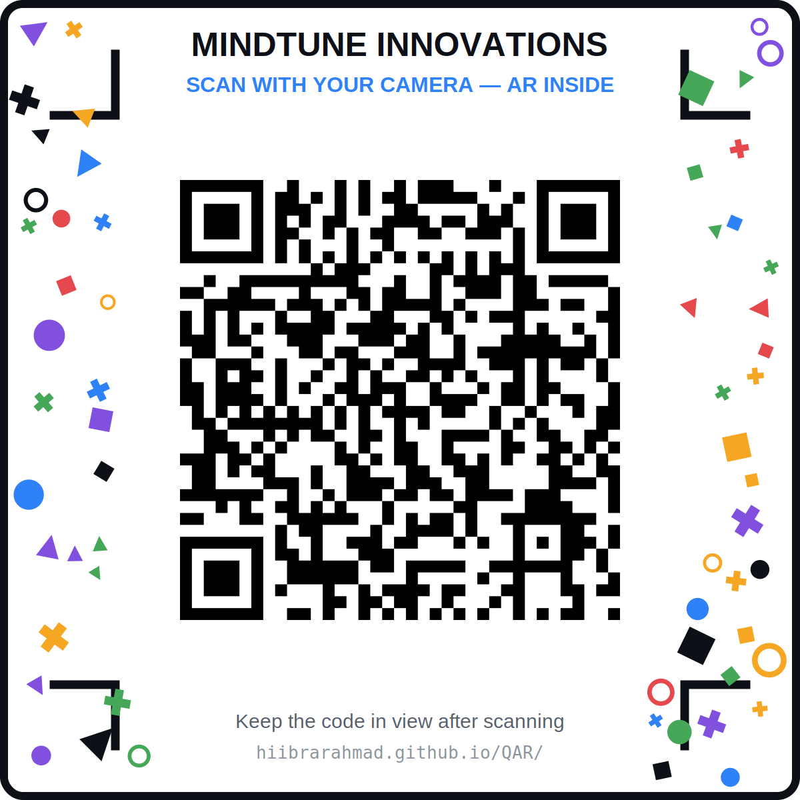

# QRAR — QR code that becomes an AR anchor

**Live:** https://hiibrarahmad.github.io/QAR/

Scan this with your phone camera (Android / iPhone):

<p align="center">
  
</p>

Scanning it opens the AR page above → tap **Launch AR** → point the camera
back at the same QR code → content anchors to it and tracks in real time,
staying locked on as long as the code is in frame.

No app install. Runs in Chrome (Android) and Safari (iOS 14+).

**Tech:** [MindAR](https://github.com/hiukim/mind-ar-js) image tracking + A-Frame
(vendored locally in `vendor/`, not loaded from a CDN — see note below).
AR.js pattern markers were rejected: they need a thick black border and lose
QR detail, whereas MindAR tracks the real QR image directly.

## Files

| File | Purpose |
|---|---|
| `index.html` | The AR viewer people land on. Edit `CONFIG` at the top. |
| `tools/make-qr.mjs` | Generates `qr-card.svg` — QR (error-correction H) + a dense field of unique shapes around it for reliable tracking. |
| `tools/target-compiler.html` | Compiles `qr-card.svg` → `targets.mind`, entirely in-browser. |
| `targets.mind` | Compiled tracking data — must sit next to `index.html`. |
| `vendor/` | Local copies of A-Frame + MindAR. The MindAR CDN build ships as an ES module and silently fails as a plain `<script>` tag — vendoring avoids that and works offline. |

## Changing the content

Edit the `CONFIG` block at the top of `index.html`:

- `MODE: "demo"` — floating 3D text (current default, no assets needed)
- `MODE: "model"` + `SRC: "assets/robot.glb"` — 3D model (keep under ~5 MB)
- `MODE: "video"` + `SRC: "assets/promo.mp4"` — H.264 mp4 (starts muted, tap to unmute — iOS autoplay rule)
- `MODE: "image"` + `SRC: "assets/cv.png"` — e.g. a CV page exported as PNG, `ASPECT: 1.414` for A4

Put asset files in `assets/`, commit, and push — GitHub Pages redeploys
automatically. The QR code and `targets.mind` stay valid; you don't need to
regenerate either one just to swap content.

## Regenerating the QR / target (only if the URL or card design changes)

```
node tools/make-qr.mjs https://hiibrarahmad.github.io/QAR/
```

Then open `tools/target-compiler.html` in a browser (served over HTTP/HTTPS,
not `file://`, so `fetch` works) with `?src=/qr-card.svg` to auto-compile, or
drag the SVG in manually. Download the result as `targets.mind` into the
project root.

## Tips for solid tracking

- **Print it** — camera-at-a-screen (moiré, glare) is the worst-case test.
  Paper, ideally matte, 6×6 cm or larger, tracks noticeably better.
- Flat surface, good even light, no glare.
- Don't crop the border shapes/brackets off the card — a bare QR is a
  repetitive pattern that's hard for an image tracker to lock onto; the
  scattered shapes give it unique features to grip.
- If you redesign the card, recompile `targets.mind` from the exact final image.
